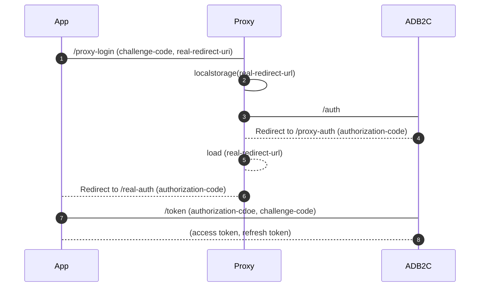

# Azure AD B2C を代理で行う。

## アーキテクチャ


```mermaid
sequenceDiagram
autonumber
participant app as App
participant proxy as Proxy
participant adb2c as ADB2C

app -> proxy : /proxy-login (challenge-code, real-redirect-uri)
proxy -> proxy: localstorage(real-redirect-url)
proxy -> adb2c : /auth
adb2c --> proxy: Redirect to /proxy-auth (authorization-code)
proxy --> proxy: load (real-redirect-url)
proxy --> app: Redirect to /real-auth (authorization-code)
app -> adb2c: /token (authorization-cdoe, challenge-code)
adb2c --> app: (access token, refresh token)
```

## ローカル環境でhttpsを使う

```bash
brew install mkcert
mkcert -install
mkcert localhost
```
